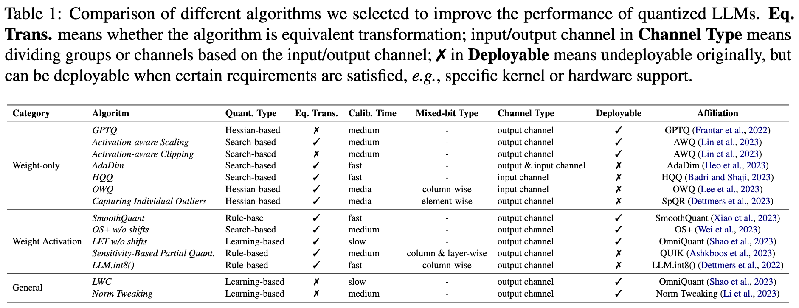

# llmc: Towards Accurate and Efficient LLM Compression


[](https://opensource.org/licenses/Apache-2.0) 
[](https://github.com/ModelTC/llmc)

llmc is a sophisticated tool designed for compressing LLM, leveraging state-of-the-art compression algorithms to enhance efficiency and reduce model size without compromising performance. 

This tool is implemented in Pytorch by the following main contributors:

[Yushi Huang](https://github.com/Harahan/), [Yang Yong](https://github.com/helloyongyang), [Shiqiao Gu](https://github.com/gushiqiao), [Ruihao Gong](https://xhplus.github.io/)

## News

* **Mar 7, 2024:** 🚀 We release the quantization part of a powerful and efficient LLM compression tool. Notably, our benchmark paper is coming soon😊.

## Highlight Feature

* Quantize LLMs, e.g., Llama2-70B, OPT-175B,  and evaluate their PPL on only one A100/H100/H800 GPU💥.
* SOTA compression algorithms for users to choose from, and users can sequentially employ multiple algorithms on one LLM💥.
* Transformed model (``save_fp``  mode in ``quant`` part in [Configuration](#configuration)) exported by our tool with a specifical compression algorithm can go through naive quantization by multiple backends, e.g., [Lightllm](https://github.com/ModelTC/lightllm), [TensorRT-LLM](https://github.com/NVIDIA/TensorRT-LLM) to get a specifical-compression-algorithm-optimized model, which can be inferred by the corresponding backend💥.
* Our compressed model (``save_quant``  mode in ``quant`` part in [Configuration](#configuration)) with a very low memory footprint can be directly inferred by [Lightllm](https://github.com/ModelTC/lightllm)💥.

## Usage

1. Clone this repository and install packages:

   ```shell
   # install packages
   cd llmc
   pip install -r requirements.txt
   ```

2. Prepare models and data. 

   ```shell
   # After downloading LLMs from huggingface, prepare calibration and evaluation data as follows:
   cd tools
   python download_calib_dataset.py --save_path [calib data path]
   python download_eval_dataset.py --save_path [eval data path] 
   ```

3. Choose an algorithm to quantize your model:

   ```shell
   # Here's an example about Awq:
   cd scripts
   # Modify the path of llmc, ``llmc_path``, in the bash file. You can also choose one config 
   # placed in ``llmc/configs/quantization/Awq/`` to quantize your model, or your own
   # config referring to those we provide by changing the ``--config`` argument in run_awq_llama.sh.
   bash run_awq_llama.sh
   ```

## Configuration

To help users design their own configs, we now explain some universal configurations in all configs we provide under ``llmc/configs/``:

* ``model``:

  ```yaml
  model:
      # Replace by the name of the class in ``llmc/llmc/models/*.py``.
      type: Llama
      # Replace by the path of your model.
      path: model path 
      torch_dtype: auto
  ```

* ``calib``: 

  ```yaml
  # Note: some algorithms do not need ``calib``, like naive... So, you can remove this part.
  calib:
      # Replace by the calibration data name, e.g., pileval, c4, wikitext2, or ptb, downloaded before.
      name: pileval
      download: False
      # Replace by the path of one of the calibration data, e.g., pileval, c4, wikitext2, or ptb, 
      # downloaded before.
      path: calib data path
      n_samples: 128
      bs: -1
      seq_len: 512
      # Replace by the function name in ``llmc/llmc/data/dataset/specified_preproc.py``.
      preproc: general  
      seed: *seed
  ```

* ``eval``:

  ```yaml
  # If you want to evaluate PPL of your pretrained/transformed/fake_quant model.
  eval:
      # You can evaluate the pretrain, transformed, fake_quant model, and set the position 
      # you want to evaluate.
      eval_pos: [pretrain, transformed, fake_quant]
      # Replace by the name of the eval data, e.g., c4, wikitext2, ptb or [c4, wikitext2],
      # downloaded before.
      name: wikitext2
      download: False
      path: eval data path
      # For 70B model eval, bs can be set to 20, and inference_per_block can be set to True.
      # For 7B / 13B model eval, bs can be set to 1, and inference_per_block can be set to False.
      bs: 1
      inference_per_block: False
      seq_len: 2048
  ```

* ``save``:

  ```yaml
  save:
      # ``save_fp`` is True means you want to export the transformed model, e.g., parameter-modified
      # model, whose performance and structure are the same as the original model, and users can 
      # utilize naive quantization to the transformed model to obtain the same performance as 
      # the specifical-algorithm-quantized model.
      save_fp: False
      # ``save_quant`` is True means you want to export a real quant model, e.g.,
      # low-bit weights with weight and activation quantization parameters.
      save_quant: False
      # ``save_quant`` is True means you want to export fake_quant model, e.g.,
      # dequantized weight with activation quantization parameters.
      save_fake: False
      save_path: ./save
  ```

  

* ``quant``:

  ```yaml
  quant:
      # Replace by the class name in ``llmc/compression/quantization/*.py``
      method: OmniQuant
      # weight-only quantization does not have ``act`` part.
      weight:
          bit: 8
          symmetric: True
          # Quantization granularity: per_channel, per_tensor, per_head (not recommanded).
          granularity: per_channel
          group_size: -1
          # Calibration algorithms: learnble, mse, and minmax (default).
          calib_algo: learnable
          # Utilize Stright-Through Estimation, which is necessary for learnable
          # calibration algorithms.
          ste: True
      act:
          bit: 8
          symmetric: True
          # Quantization granularity: per_token, per_tensor
          granularity: per_token
          ste: True
          # Static quantization (quantization during calibration)or dynamic 
          # quantization (quantization during inference).
          static: True
      # This part is designed for specific algorithms, users can refer to
      # those we provide to design their own.
      special:
          let: True 
          lwc_lr: 0.01
          let_lr: 0.005
          use_shift: False
          alpha: 0.5
          deactive_amp: True
          epochs: 20
          wd: 0
      # If quant_out is True, employ the outputs of the former quantized block as the 
      # calibration data of the proceeding block.
      quant_out: True
  ```

## Supported Model List

✅ [BLOOM](https://huggingface.co/bigscience/bloom)

✅ [LLaMA](https://github.com/facebookresearch/llama)

✅ [LLaMA V2](https://huggingface.co/meta-llama)

✅ [StarCoder](https://github.com/bigcode-project/starcoder)

✅ [OPT](https://huggingface.co/docs/transformers/model_doc/opt)

✅ [Falcon](https://huggingface.co/docs/transformers/model_doc/falcon)

✅ [InternLM2](https://huggingface.co/internlm)

✅ [Mistral](https://huggingface.co/docs/transformers/model_doc/mistral)

You can add your own model type referring to files under ``llmc/llmc/models/*.py``.

## Supported Algorithm List

### Quantization

✅ Naive

✅ [AWQ](https://arxiv.org/abs/2306.00978)

✅ [GPTQ](https://arxiv.org/abs/2210.17323)

✅ [SmoothQuant](https://arxiv.org/abs/2211.10438)

✅ [OS+](https://arxiv.org/abs/2304.09145)

✅ [OmniQuant](https://arxiv.org/abs/2308.13137)

✅ [NormTweaking](https://arxiv.org/abs/2309.02784)

✅ [AdaDim](https://arxiv.org/pdf/2309.15531.pdf)

✅ [QUIK](https://arxiv.org/abs/2310.09259)

✅ [SpQR](https://arxiv.org/abs/2306.03078)

✅ [DGQ](https://arxiv.org/abs/2310.04836)

✅ [OWQ](https://arxiv.org/abs/2306.02272)

✅ [LLM.int8()](https://arxiv.org/abs/2208.07339)

✅ [HQQ](https://mobiusml.github.io/hqq_blog/)

We provide an overview table of the quantization algorithms in this tool as follows (We split algorithms in their original paper into a finer granularity as ``Algorithm`` in the table):



### Pruning

This part is coming soon🚀. 

## TODO List

### Quantization

- [ ] QuIP

- [ ] QuIP#

- [ ] AQLM

**Note:** Some specific algorithms like QUIK, SpQR, needing special hardware or kernel support can not go through naive quantization by multiple backends, and then utilize these backends to infer. However, users can still use our tool to evaluate the performance of these algorithms in their research.

### Pruning

- [ ] SparseGPT

- [ ] Wanda

- [ ] LLM-Pruner

This part is coming soon🚀.

### Docs

- [ ] End-to-end examples of compressing a model and then utilizing multiple backends, e.g., [Lightllm](https://github.com/ModelTC/lightllm), [TensorRT-LLM](https://github.com/NVIDIA/TensorRT-LLM), to infer.

- [ ] Docs about ``special``  in ``quant`` part in [Configuration](#configuration) for different algorithms.

- [ ] Docs about adding new algorithms by users themselves.

More detailed Docs are coming soon🚀.

## Acknowledgments

We develop our code referring to the following repos:

* https://github.com/mit-han-lab/llm-awq
* https://github.com/mit-han-lab/smoothquant
* https://github.com/OpenGVLab/OmniQuant
* https://github.com/IST-DASLab/gptq
* https://github.com/ModelTC/Outlier_Suppression_Plus
* https://github.com/IST-DASLab/QUIK
* https://github.com/Vahe1994/SpQR
* https://github.com/ilur98/DGQ
* https://github.com/xvyaward/owq
* https://github.com/TimDettmers/bitsandbytes
* https://github.com/mobiusml/hqq

## Citation

```
@misc{huang2024llmc,
    author = {Huang, Yushi and Yong, Yang and Gu, Shiqiao and Gong, Ruihao}
    year = {2024},
    publisher = {GitHub},
    howpublished = {\url{https://github.com/ModelTC/llmc}} 
}
```

