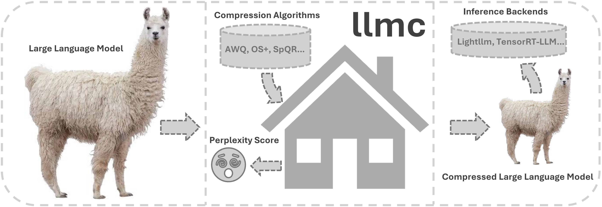
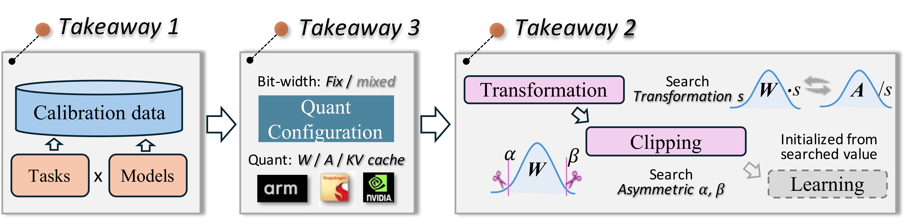

# LLMC: 正確で効率的なLLM圧縮に向けて



<div align="center">

[](https://opensource.org/licenses/Apache-2.0)
[](https://arxiv.org/abs/2405.06001)
[](https://github.com/ModelTC/llmc)

[](https://discord.com/invite/NfJzbkK3jY)
[](http://qm.qq.com/cgi-bin/qm/qr?_wv=1027&k=I9IGPWWj8uuRXWH3_ELWjouf6gkIMgUl&authKey=GA3WbFAsm90ePJf%2FCbc7ZyXXq4ShQktlBaLxgqS5yuSPAsr3%2BDKMRdosUiLYoilO&noverify=0&group_code=526192592)
[](https://llmc-en.readthedocs.io/en/latest/)
[](https://llmc-zhcn.readthedocs.io/en/latest/)

</div>

**\[ English | [中文](README_zh.md) | [日本語](README_ja.md) \]**

**LLMC** は、大規模言語モデル（LLM）の圧縮を目的とした、最新の圧縮アルゴリズムを活用して、パフォーマンスを損なうことなく効率を向上させ、モデルサイズを削減するためのツールです。

**英語のドキュメント**は[こちら](https://llmc-en.readthedocs.io/en/latest/)。

**中国語のドキュメント**は[こちら](https://llmc-zhcn.readthedocs.io/en/latest/)。

**Docker Hub**は[こちら](https://hub.docker.com/r/llmcompression/llmc)。

**aliyun docker**: `registry.cn-hangzhou.aliyuncs.com/yongyang/llmcompression:[tag]`

以下のコマンドを使用して、llmcを実行できるDockerイメージをダウンロードできます。中国大陸のユーザーは、阿里云Dockerを使用することを推奨します。

docker hub

```
docker pull llmcompression/llmc:pure-latest
```

阿里云Docker

```
docker pull registry.cn-hangzhou.aliyuncs.com/yongyang/llmcompression:pure-latest
```

**コミュニティ**:

- [Discordサーバー](https://discord.com/invite/NfJzbkK3jY)
- [Tencent QQグループ](http://qm.qq.com/cgi-bin/qm/qr?_wv=1027&k=I9IGPWWj8uuRXWH3_ELWjouf6gkIMgUl&authKey=GA3WbFAsm90ePJf%2FCbc7ZyXXq4ShQktlBaLxgqS5yuSPAsr3%2BDKMRdosUiLYoilO&noverify=0&group_code=526192592)

## 最新情報

- **2024年11月20日:** 🔥 私たちは現在、✨`DeepSeekv2(2.5)`などの`MOE`モデルおよび✨`Qwen2VL`、`Llama3.2`などの`VLM`モデルの量子化を完全にサポートしています。対応する量子化手法には、✅整数量子化、✅浮動小数点量子化、さらに✅AWQ、✅GPTQ、✅SmoothQuant、✅Quarotといった高度なアルゴリズムが含まれます。

- **2024年11月12日:** 🔥 私たちは💥`アクティベーション静的per-tensor`量子化のサポートを、様々なモデルやアルゴリズムに追加しました。これにより、✅整数量子化および✅浮動小数点量子化をカバーし、性能と効率をさらに最適化します。また、✨`真の量子化モデル`のエクスポートをサポートし、[VLLM](https://github.com/vllm-project/vllm)および[SGLang](https://github.com/sgl-project/sglang)バックエンドを使用した推論の高速化も可能です。詳細は[VLLMドキュメント](https://llmc-en.readthedocs.io/en/latest/backend/vllm.html)および[SGLangドキュメント](https://llmc-en.readthedocs.io/en/latest/backend/sglang.html)をご参照ください。

- **2024年9月26日:** 🔥 `LLMC`からの✨ `FP8量子化（E4M3、E5M2）`モデルを、VLLMやSGLangのような高度な推理バックエンドにエクスポートできるようになりました。🚀 詳細な使用方法については、[VLLMのドキュメント](https://llmc-en.readthedocs.io/en/latest/backend/vllm.html)と[SGLangのドキュメント](https://llmc-en.readthedocs.io/en/latest/backend/sglang.html)を参照してください。

- **2024年9月24日:** 🔥 私たちは正式に ✨`Llama-3.1-405B` の ✅INT4 と ✅INT8 モデルをリリースしました。これらは 🚀`LLMC` の `save_lightllm` モードを使用して量子化されています。モデルパラメータは[こちら](https://huggingface.co/Dongz/llama31-405b-quant)からダウンロードできます。

- **2024年9月23日:** 🔥 私たちは、🚀`LLMC` から ✨`実際の量子化された(INT4, INT8)` モデルを、 [VLLM](https://github.com/vllm-project/vllm), [SGLang](https://github.com/sgl-project/sglang), [AutoAWQ](https://github.com/casper-hansen/AutoAWQ), [MLC-LLM](https://github.com/mlc-ai/mlc-llm) などの高度な推論バックエンドにエクスポートするサポートを追加しました。これにより、✨`メモリ使用量の削減` と ✨`推論速度の向上` が可能になります。
  詳細については、[VLLMドキュメント](https://llmc-en.readthedocs.io/en/latest/backend/vllm.html)、[SGLangドキュメント](https://llmc-en.readthedocs.io/en/latest/backend/sglang.html)、[AutoAWQドキュメント](https://llmc-en.readthedocs.io/en/latest/backend/autoawq.html)、および [MLC-LLMドキュメント](https://llmc-en.readthedocs.io/en/latest/backend/mlcllm.html) を参照してください。

- **2024年9月9日:** 🔥 パフォーマンス向上のためのベストプラクティス構成をいくつか提供しています（ベストプラクティスは[こちら](https://llmc-en.readthedocs.io/en/latest/)をご覧ください）。

- **2024年9月3日:** 🔥 私たちは、[opencompass](https://github.com/open-compass/opencompass) を使用して 🚀`LLMC` モデルを評価するサポートを提供しています。この[ドキュメント](https://llmc-en.readthedocs.io/en/latest/advanced/model_test_v2.html)に従って試してみてください！

- **2024年8月22日:** 🔥私たちは現在のSOTAモデル [SmolLM](https://huggingface.co/collections/HuggingFaceTB/smollm-6695016cad7167254ce15966) を含む多くの小型言語モデルをサポートしています（[サポートされているモデルリスト](#supported-model-list)を参照してください）。

- **2024年8月22日:** 🔥また、修正された [lm-evaluation-harness](https://github.com/EleutherAI/lm-evaluation-harness) を使用した下流タスクの評価もサポートしています 🤗。具体的には、`save_trans` モードを使用して（[構成](https://llmc-en.readthedocs.io/en/latest/configs.html)の `save` 部分を参照）変換されたモデルを保存し、その後、[run_lm_eval.sh](scripts/run_lm_eval.sh) を参照して量子化されたモデルを直接評価できます。詳細は[こちら](https://llmc-en.readthedocs.io/en/latest/advanced/model_test_v1.html)をご覧ください。

- **2024年7月23日:** 🍺🍺🍺 新しいベンチマーク論文をリリースしました：

  [**LLMC: Benchmarking Large Language Model Quantization with a Versatile Compression Toolkit**](https://arxiv.org/abs/2405.06001v2)。

  [Ruihao Gong\*](https://xhplus.github.io/), [Yang Yong\*](https://github.com/helloyongyang), [Shiqiao Gu\*](https://github.com/gushiqiao), [Yushi Huang\*](https://github.com/Harahan), [Chengtao Lv](https://scholar.google.com/citations?user=r8vseSUAAAAJ&hl=en), [Yunchen Zhang](https://scholar.google.com/citations?user=glkWFyUAAAAJ&hl=en), [Xianglong Liu📧](https://xlliu-beihang.github.io/), [Dacheng Tao](https://scholar.google.com/citations?user=RwlJNLcAAAAJ&hl=en)

  (\*は同等の貢献を示し、📧は対応する著者を示します。)

<details close>
<summary>過去のニュース</summary>

- **2024年7月16日:** 🔥私たちはLLMの疎化のためのWanda/Naive（マグニチュード）および層ごとの混合ビット量子化のサポートを追加しました！

- **2024年7月14日:** 🔥私たちは回転ベースの量子化 QuaRot のサポートを追加しました！

- **2024年5月17日:** 🚀 私たちは、LLaVA、Mixtral、LLaMA V3、Qwen V2などのいくつかの高度な大規模モデルをサポートしています。お試しください！

- **2024年5月13日:** 🍺🍺🍺 私たちは量子化ベンチマーク論文をリリースしました：

  [**LLM-QBench: A Benchmark Towards the Best Practice for Post-training Quantization of Large Language Models**](https://arxiv.org/abs/2405.06001)。

  [Ruihao Gong\*](https://xhplus.github.io/), [Yang Yong\*](https://github.com/helloyongyang), [Shiqiao Gu\*](https://github.com/gushiqiao), [Yushi Huang\*](https://github.com/Harahan), [Yunchen Zhang](https://scholar.google.com/citations?user=glkWFyUAAAAJ&hl=en), [Xianglong Liu📧](https://xlliu-beihang.github.io/), [Dacheng Tao](https://scholar.google.com/citations?user=RwlJNLcAAAAJ&hl=en)

  (\*は同等の貢献を示し、📧は対応する著者を示します。)

  <div align=center>
   
  </div>

  私たちは、校正コスト、推論効率、量子化精度を考慮して、量子化技術を公正にベンチマークしました。さまざまなモデルとデータセットに関して600件近い実験を行い、校正データ、アルゴリズムパイプライン、および量子化構成の選択に関する3つの洞察を得ました。これらの洞察に基づいて、LLMの後処理量子化パイプラインに対するベストプラクティスが設計され、さまざまなシナリオでのパフォーマンスと効率のバランスを実現します。

- **2024年3月7日:** 🚀 私たちは強力で効率的なLLM圧縮ツールの量子化部分をリリースしました。なお、ベンチマーク論文は近日中に公開予定です😊。

</details>

## 主要機能

- 💥**包括的なアルゴリズムサポート**: 広範な ✨`SOTA圧縮アルゴリズム` をサポートし、✅量子化、✅混合精度量子化、✅疎性を含み、元のリポジトリと同じ精度を維持します。✨`量子化ベストプラクティス`（ベストプラクティスは[こちら](https://llmc-en.readthedocs.io/en/latest/)をご覧ください）も提供されており、最適なパフォーマンスと効率を確保します。

- 💥**サポートされているフォーマット**: ✨`量子化`（整数および浮動小数点）と ✨`疎性` の両方をサポートし、具体的には ✅重量-活性化、✅重量のみ、✅混合精度量子化、および ✅構造化疎性 と ✅非構造化疎性 を含みます。

- 💥**広範なモデルサポート**: 多様な ✨`LLMモデル` をサポートしており、✅LLama、✅Mistral、✅InternLM2、✅Qwen2 など、さらに ✅✅MOE(DeepSeekv2, Deepseekv2.5) モデルや ✅VLM(Llama3.2-vision, Qwen2-vl) モデルもサポートしています（[サポートされているモデルリスト](#supported-model-list)を参照してください）。

- 💥**マルチバックエンドの互換性**: 複数のバックエンドとシームレスに統合し、展開の柔軟性を強化します。さまざまな量子化設定およびモデルフォーマットが、✅VLLM、✅Sglang、✅LightLLM、✅MLC-LLM、✅AutoAWQ など、幅広いバックエンドおよびハードウェアプラットフォームと互換性があり、高い柔軟性を実現しています（`Backend`セクションは[こちら](https://llmc-en.readthedocs.io/en/latest/)をご覧ください）。

- 💥**パフォーマンス効率**: ✨`Llama3.1-405B` や ✨`DeepSeekV2-236B` などの大規模LLMの量子化をサポートし、`単一の A100/H100/H800 GPU` でPPL評価を可能にします。

## 使用方法

使用ガイドは 🚀`Quick Start`セクション[こちら](https://llmc-en.readthedocs.io/en/latest/)をご覧ください。

## サポートされているモデルリスト

✅ [BLOOM](https://huggingface.co/bigscience/bloom)

✅ [LLaMA](https://github.com/facebookresearch/llama)

✅ [LLaMA V2](https://huggingface.co/meta-llama)

✅ [StarCoder](https://github.com/bigcode-project/starcoder)

✅ [OPT](https://huggingface.co/docs/transformers/model_doc/opt)

✅ [Falcon](https://huggingface.co/docs/transformers/model_doc/falcon)

✅ [InternLM2](https://huggingface.co/internlm)

✅ [Mistral](https://huggingface.co/docs/transformers/model_doc/mistral)

✅ [LLaMA V3](https://huggingface.co/meta-llama)

✅ [Mixtral](https://huggingface.co/docs/transformers/model_doc/mixtral)

✅ [Qwen V2](https://github.com/QwenLM/Qwen2)

✅ [LLaVA](https://github.com/haotian-liu/LLaVA)

✅ [InternLM2.5](https://huggingface.co/internlm)

✅ [StableLM](https://github.com/Stability-AI/StableLM)

✅ [Gemma2](https://huggingface.co/docs/transformers/main/en/model_doc/gemma2)

✅ [Phi2](https://huggingface.co/microsoft/phi-2)

✅ [Phi 1.5](https://huggingface.co/microsoft/phi-1_5)

✅ [MiniCPM](https://github.com/OpenBMB/MiniCPM)

✅ [SmolLM](https://huggingface.co/collections/HuggingFaceTB/smollm-6695016cad7167254ce15966)

✅ [DeepSeekv2.5](https://huggingface.co/deepseek-ai/DeepSeek-V2.5)

✅ [LLaMA V3.2 Vision](https://huggingface.co/meta-llama/Llama-3.2-11B-Vision)

✅ [Qwen MOE](https://huggingface.co/Qwen/Qwen1.5-MoE-A2.7B)

✅ [Qwen2-VL](https://huggingface.co/Qwen/Qwen2-VL-7B-Instruct)

✅ [InternVL2](https://huggingface.co/OpenGVLab/InternVL2-2B)

独自のモデルタイプを追加するには、`llmc/models/*.py` ファイルを参照してください。

## サポートされているバックエンドリスト

✅ [VLLM](https://github.com/vllm-project/vllm)

✅ [LightLLM](https://github.com/ModelTC/lightllm)

✅ [Sglang](https://github.com/sgl-project/sglang)

✅ [MLC-LLM](https://github.com/mlc-ai/mlc-llm)

✅ [AutoAWQ](https://github.com/casper-hansen/AutoAWQ)

## サポートされているアルゴリズムリスト

### 量子化

✅ Naive

✅ [AWQ](https://arxiv.org/abs/2306.00978)

✅ [GPTQ](https://arxiv.org/abs/2210.17323)

✅ [SmoothQuant](https://arxiv.org/abs/2211.10438)

✅ [OS+](https://arxiv.org/abs/2304.09145)

✅ [OmniQuant](https://arxiv.org/abs/2308.13137)

✅ [NormTweaking](https://arxiv.org/abs/2309.02784)

✅ [AdaDim](https://arxiv.org/pdf/2309.15531.pdf)

✅ [QUIK](https://arxiv.org/abs/2310.09259)

✅ [SpQR](https://arxiv.org/abs/2306.03078)

✅ [DGQ](https://arxiv.org/abs/2310.04836)

✅ [OWQ](https://arxiv.org/abs/2306.02272)

✅ [LLM.int8()](https://arxiv.org/abs/2208.07339)

✅ [HQQ](https://mobiusml.github.io/hqq_blog/)

✅ [QuaRot](https://arxiv.org/abs/2404.00456)

✅ [SpinQuant](https://arxiv.org/abs/2405.16406) **([このブランチを参照してください](https://github.com/ModelTC/llmc/tree/dev_spinquant))**

✅ [TesseraQ](https://arxiv.org/abs/2410.19103)

### プルーニング（剪定）

✅ Naive（マグニチュード）

✅ [Wanda](https://arxiv.org/abs/2306.11695)

✅ [ShortGPT](https://arxiv.org/abs/2403.03853)

## 謝辞

以下のリポジトリを参考にしてコードを開発しました：

- https://github.com/mit-han-lab/llm-awq
- https://github.com/mit-han-lab/smoothquant
- https://github.com/OpenGVLab/OmniQuant
- https://github.com/IST-DASLab/gptq
- https://github.com/ModelTC/Outlier_Suppression_Plus
- https://github.com/IST-DASLab/QUIK
- https://github.com/Vahe1994/SpQR
- https://github.com/ilur98/DGQ
- https://github.com/xvyaward/owq
- https://github.com/TimDettmers/bitsandbytes
- https://github.com/mobiusml/hqq
- [https://github.com/spcl/QuaRot](https://github.com/spcl/QuaRot)
- [https://github.com/locuslab/wanda](https://github.com/locuslab/wanda)
- [https://github.com/EleutherAI/lm-evaluation-harness](https://github.com/EleutherAI/lm-evaluation-harness)
- [https://github.com/facebookresearch/SpinQuant](https://github.com/facebookresearch/SpinQuant)
- [https://github.com/Intelligent-Computing-Lab-Yale/TesseraQ](https://github.com/Intelligent-Computing-Lab-Yale/TesseraQ)

## スター履歴

[](https://star-history.com/#ModelTC/llmc&Timeline)

## 引用

LLM-QBench論文/llmcツールキットが研究に役立つまたは関連している場合は、論文を引用してください：

```
@misc{llmc,
   author = {llmc contributors},
   title = {llmc: Towards Accurate and Efficient LLM Compression},
   year = {2024},
   publisher = {GitHub},
   journal = {GitHub repository},
   howpublished = {\url{https://github.com/ModelTC/llmc}},
}

@misc{gong2024llmqbench,
      title={LLM-QBench: A Benchmark Towards the Best Practice for Post-training Quantization of Large Language Models},
      author={Ruihao Gong and Yang Yong and Shiqiao Gu and Yushi Huang and Yunchen Zhang and Xianglong Liu and Dacheng Tao},
      year={2024},
      eprint={2405.06001},
      archivePrefix={arXiv},
      primaryClass={cs.LG}
}

@misc{gong2024llmcbenchmarkinglargelanguage,
      title={LLMC: Benchmarking Large Language Model Quantization with a Versatile Compression Toolkit},
      author={Ruihao Gong and Yang Yong and Shiqiao Gu and Yushi Huang and Chentao Lv and Yunchen Zhang and Xianglong Liu and Dacheng Tao},
      year={2024},
      eprint={2405.06001},
      archivePrefix={arXiv},
      primaryClass={cs.LG},
      url={https://arxiv.org/abs/2405.06001},
}
```
